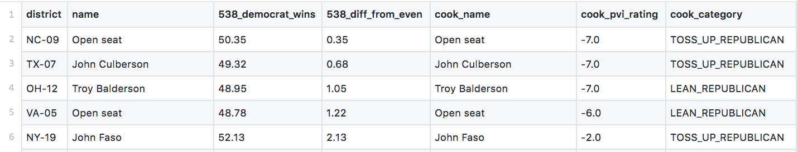

# which_house_races_are_close

I was trying to decide which House races were actually close enough that my time or money could make a difference. So I parsed [FiveThirtyEight's assessments](https://fivethirtyeight.com/features/the-big-picture-in-the-race-for-the-house/), parsed [Cook's assessments](https://www.cookpolitical.com/ratings/house-race-ratings), and wrote some code to join the two datasets together. (To my knowledge, this combined data doesn't exist in easily sortable/parseable form). This is current as of 8/17/18. Click on [combined_data.csv](combined_data.csv) to see the results + download them. 

### Files

- **combined_data.csv** is the combined data file. It is sorted so the races FiveThirtyEight predicts will be closest are at the top. You can load it into Python/R/Excel and parse it however you choose. Column names: 
    - district: the name of the district
    - name: 538's name for the incumbent
    - 538_democrat_wins: the percentage chance the Democrat wins, according to the FiveThirtyEight model (0 - 100).
    - 538_diff_from_even: the absolute difference between 538_democrat_wins and 50. Table is sorted by this column.
    - cook_name: Cook's name -- just used this so people can see if something went wrong with the data parsing.
    - cook_pvi_rating: Cook's PVI rating -- negative values indicate Republican is winning.
    - cook_category -- the category Cook puts the race in
    
For example, the top of the table looks like 

- **cook_original_data.txt** and **fivethirtyeight_original_data.txt** are my versions of the original data. 
- **goodbye_stranger.ipynb** contains the parsing + analysis code (that is just the song I was listening to when I wrote it). 

Please contact emmap1@cs.stanford.edu with any comments, questions, or errors. 
