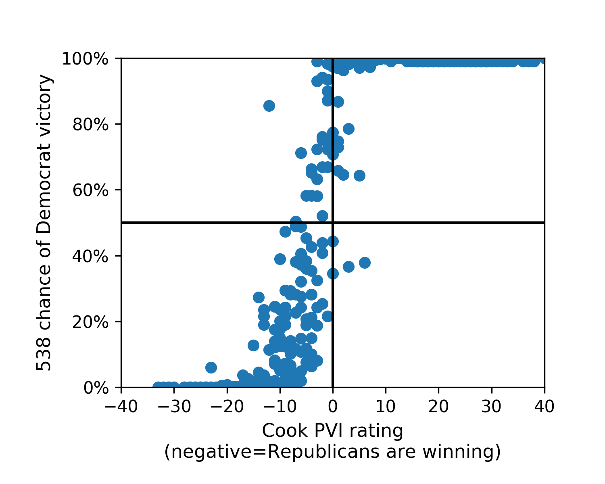

# which_house_races_are_close

I was trying to decide which House races were actually close enough that my time or money could make a difference. So I parsed [FiveThirtyEight's assessments](https://fivethirtyeight.com/features/the-big-picture-in-the-race-for-the-house/), parsed [Cook's assessments](https://www.cookpolitical.com/ratings/house-race-ratings), and wrote some code to join the two datasets together. Jeff Leek also added information about the fundraising data in close races ([source: Q2 Fundraising Data](https://www.dailykos.com/stories/2018/7/17/1781034/-Daily-Kos-Elections-2Q-2018-House-fundraising-reports-roundup)), which is useful if you want to know who actually needs money and who has a lot already. (To my knowledge, this combined data doesn't exist in easily sortable/parseable form). This is current as of 8/17/18. Click on [combined_data.csv](combined_data.csv) to see the results + download them. 

**Important update:** Wikipedia, bless them, implemented a version of this idea which will likely be better and more current! See their table [here](https://en.wikipedia.org/wiki/United_States_House_of_Representatives_elections,_2018#Latest_published_ratings_for_competitive_seats). 

### Files

- **combined_data.csv** is the combined data file. It is sorted so the races FiveThirtyEight predicts will be closest are at the top. You can load it into Python/R/Excel and parse it however you choose. Column names: 
    - district: the name of the district
    - name: 538's name for the incumbent
    - 538_democrat_wins: the percentage chance the Democrat wins, according to the FiveThirtyEight model (0 - 100).
    - 538_diff_from_even: the absolute difference between 538_democrat_wins and 50. Table is sorted by this column.
    - cook_name: Cook's name -- just used this so people can see if something went wrong with the data parsing.
    - cook_pvi_rating: Cook's PVI rating -- negative values indicate Republican is winning.
    - cook_category -- the category Cook puts the race in
    
For example, the top of the table looks like 

- **cook_original_data.txt** and **fivethirtyeight_original_data.txt** are my versions of the original data. 
- **goodbye_stranger.ipynb** contains the parsing + analysis code (that is just the song I was listening to when I wrote it). 

Here's a scatterplot of Cook's PVI's versus FiveThirtyEight's probabilities. 

Please contact emmap1@cs.stanford.edu with any comments, questions, or errors. 

### These files created by Jeff Leek

Please contact jtleek@gmail.com with comments/questions or errors

- **fundraise_2018_dailykos.csv** - fundraising data for close races from [dailykos](https://www.dailykos.com/stories/2018/7/17/1781034/-Daily-Kos-Elections-2Q-2018-House-fundraising-reports-roundup) with columns
    - state: state of the raise
    - district: district within that state
    - name: name of the candidate
    - party: original party information from DK - this is tidied in later columns
    - q2_raised through transfer: the amounts raised or on hand (I think ) for q2
    - committee_id/candidate_id: I think these are DK ids maybe? 
    - incumbant - inferred incumbant status from the party variable
    - party_ind - indicator of independent inferred from the party variable
    - party_dem - indicator of democrat inferred from the party variable
    - party_rep - indicator of republican inferred from the party variable
- **pull_fundraising.Rmd** - R markdown file showing the data pull
- **pull_fundraising.pdf** - compiled version of the data pulling code with session info

